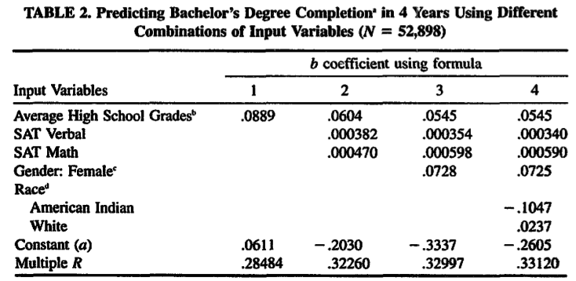
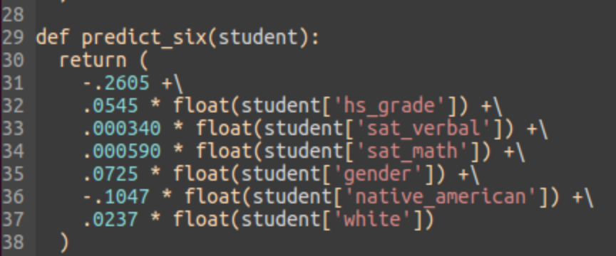

# Retention Research

# Background

## Last year

- Created model to predict retentiveness of Hougthon students
- Used lots of data
- Time consuming to repeat for current students

## Current goals

- Assess current needs for supporting Houghton students
- Identify at-risk students for early intervention and support
- Create a process which can be automatically and rapidly repeated in future years

# Methodology

-----

> An institution’s degree completion rate is primarily a reflection of its entering student characteristics, and differences among institutions in their degree completion rates are primarily attributable to differences among their student bodies at the time of entry. (Astin, 2005)

## Plan

- Organize data from as many first-time, first-year students as possible
- Apply a model to predict overall graduation rate and identify at risk students

## Data compilation

- Data was compiled by Mark Alessi to include all FTIACs since 1992
- This data will be available for new students as soon as their information is available in PowerCAMPUS

# Model

## Selection

Our model (Astin, 1997) was chosen for the following reasons:

- Data availability - The model uses four easily available variables
- Simplicity - Easy to apply linear model
- Large sample size (n=53k)

## Variables

The following variables are most predictive and used in our model:

- High School GPA
- Standardized test scores
- Gender
- Race

## Equation

## As code

# Results

## Overall assessment

-----

-----

-----

## Current cohort

-----

# Next steps

## Student Intervention

- Produced a list of all FTIACs including names and chance of graduating in six years

## Additional research

- Clean up PowerCAMPUS data
- Pull additional variable from PowerCAMPUS
- Apply machine learning model to create Houghon specific predictions

## Automation

- Data collection and analysis process is 100% automated
- Can run this analysis for next years incoming class rapidly once their data is in PowerCAMPUS
- Continue to add to this automated process

## References

Astin, A. W. (1997). How “good” is your institution's retention rate?. Research in Higher Education, 38(6), 647-658.

Astin, A. W. (2005). Making sense out of degree completion rates. Journal of college student retention, 7(1-2), 5.